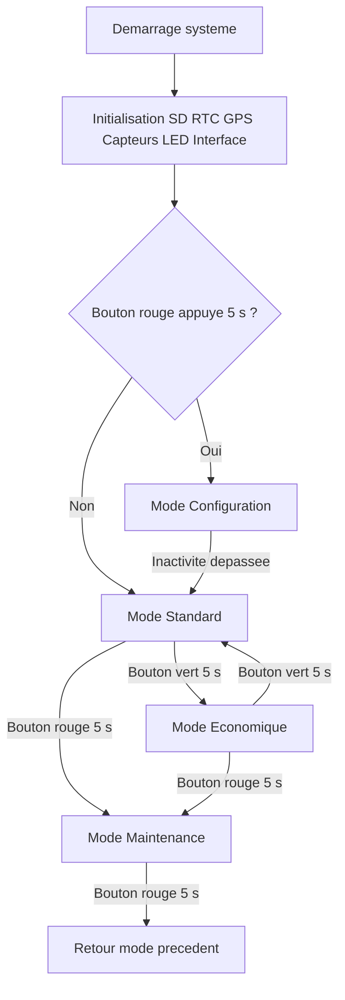
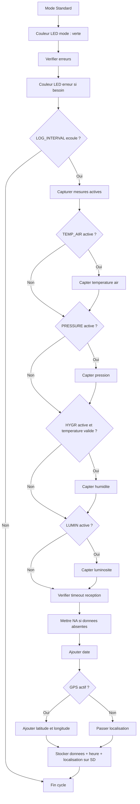
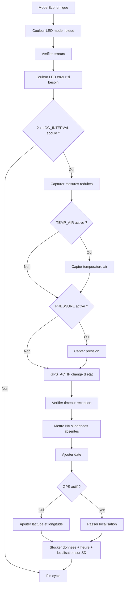
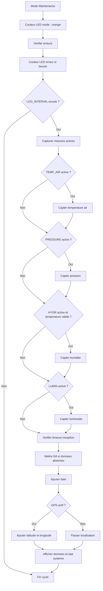

# Station_meteo

```mermaid
flowchart TD

A[Demarrage systeme] --> B[Initialisation SD RTC GPS Capteurs LED Interface]

B --> C{Bouton rouge appuye 5 s ?}

C -- Oui --> D[Mode Configuration]
C -- Non --> E[Mode Standard]

E -- Bouton vert 5 s --> F[Mode Economique]
F -- Bouton vert 5 s --> E

E -- Bouton rouge 5 s --> G[Mode Maintenance]
F -- Bouton rouge 5 s --> G
G -- Bouton rouge 5 s --> H[Retour mode precedent]

D -- Inactivite depassee --> E
```

```mermaid
flowchart TD
    A[Mode Standard] --> B[Couleur LED mode : verte]
    B --> C[Verifier erreurs]
    C --> D[Couleur LED erreur si besoin]
    D --> E{LOG_INTERVAL ecoule ?}

    E -- Non --> Z[Fin cycle]
    E -- Oui --> F[Capturer mesures actives]

    F --> G{TEMP_AIR active ?}
    G -- Oui --> G1[Capter temperature air]
    G -- Non --> H

    G1 --> H{PRESSURE active ?}
    H -- Oui --> H1[Capter pression]
    H -- Non --> I

    H1 --> I{HYGR active et temperature valide ?}
    I -- Oui --> I1[Capter humidite]
    I -- Non --> J

    I1 --> J{LUMIN active ?}
    J -- Oui --> J1[Capter luminosite]
    J -- Non --> K

    J1 --> K[Verifier timeout reception]
    K --> L[Mettre NA si donnees absentes]
    L --> M[Ajouter date]
    M --> N{GPS actif ?}
    N -- Oui --> N1[Ajouter latitude et longitude]
    N -- Non --> O[Passer localisation]

    N1 --> P[Stocker donnees + heure + localisation sur SD]
    O --> P
    P --> Z[Fin cycle]
```

```mermaid
flowchart TD
 A[Mode Economique] --> B[Couleur LED mode : bleue]
    B --> C[Verifier erreurs]
    C --> D[Couleur LED erreur si besoin]
    D --> E{2 x LOG_INTERVAL ecoule ?}

    E -- Non --> Z[Fin cycle]
    E -- Oui --> F[Capturer mesures reduites]

    F --> G{TEMP_AIR active ?}
    G -- Oui --> G1[Capter temperature air]
    G -- Non --> H

    G1 --> H{PRESSURE active ?}
    H -- Oui --> H1[Capter pression]
    H -- Non --> I

    H1 --> I[GPS_ACTIF change d etat]
    I --> J[Verifier timeout reception]
    J --> K[Mettre NA si donnees absentes]
    K --> L[Ajouter date]
    L --> M{GPS actif ?}
    M -- Oui --> M1[Ajouter latitude et longitude]
    M -- Non --> N[Passer localisation]


    M1 --> O[Stocker donnees + heure + localisation sur SD]
    N --> O
    O --> Z[Fin cycle]
```

```mermaid
flowchart TD
    A[Mode Maintenance] --> B[Couleur LED mode : orange]
    B --> C[Verifier erreurs]
    C --> D[Couleur LED erreur si besoin]
    D --> E{LOG_INTERVAL ecoule ?}

    E -- Non --> Z[Fin cycle]
    E -- Oui --> F[Capturer mesures actives]

    F --> G{TEMP_AIR active ?}
    G -- Oui --> G1[Capter temperature air]
    G -- Non --> H

    G1 --> H{PRESSURE active ?}
    H -- Oui --> H1[Capter pression]
    H -- Non --> I

    H1 --> I{HYGR active et temperature valide ?}
    I -- Oui --> I1[Capter humidite]
    I -- Non --> J

    I1 --> J{LUMIN active ?}
    J -- Oui --> J1[Capter luminosite]
    J -- Non --> K

    J1 --> K[Verifier timeout reception]
    K --> L[Mettre NA si donnees absentes]
    L --> M[Ajouter date]
    M --> N{GPS actif ?}
    N -- Oui --> N1[Ajouter latitude et longitude]
    N -- Non --> O[Passer localisation]

    N1 --> P[Afficher donnees et etat systeme]
    O --> P
    P --> Z[Fin cycle]
```
