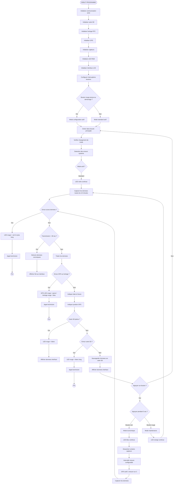

# Station_meteo

Diagram Mermaid 

```mermaid
flowchart TD

%% ===============================
%% INITIALISATION - VOID SETUP
%% ===============================

START([DEBUT PROGRAMME])

START --> SETUP1[Initialiser communication serie]
SETUP1 --> SETUP2[Initialiser carte SD]
SETUP2 --> SETUP3[Initialiser horloge RTC]
SETUP3 --> SETUP4[Initialiser GPS]
SETUP4 --> SETUP5[Initialiser capteurs]
SETUP5 --> SETUP6[Initialiser LED RGB]
SETUP6 --> SETUP7[Initialiser interface LCD]
SETUP7 --> SETUP8[Configurer interruptions boutons]

SETUP8 --> MODEINIT{Bouton rouge presse au demarrage ?}

MODEINIT -- Oui --> MODECONFIG[Mode configuration actif]
MODEINIT -- Non --> MODESTD[Mode standard actif]

MODECONFIG --> LOOPSTART
MODESTD --> LOOPSTART

%% ===============================
%% BOUCLE PRINCIPALE - VOID LOOP
%% ===============================

LOOPSTART[Entrer dans boucle principale]

LOOPSTART --> CHGMODE[Verifier changement de mode]

CHGMODE --> DETECTERR[Detection des erreurs systeme]

DETECTERR --> MODETEST{Mode actif ?}

%% ===============================
%% MODE STANDARD
%% ===============================

MODETEST -- Standard --> LEDSTD[LED verte continue]

LEDSTD --> ACQ[Capturer les donnees toutes les 10 minutes]

ACQ --> ERRDATA{Erreur acces donnees ?}

ERRDATA -- Oui --> LEDERR1[LED rouge + vert 2x plus long]
LEDERR1 --> TECH1[Appel technicien]
TECH1 --> END1((Fin))

ERRDATA -- Non --> TIMEOUT{Transmission > 30 sec ?}

TIMEOUT -- Oui --> DESTROY[Detruire donnees corrompues]
DESTROY --> DISPLAYNA[Afficher NA sur interface]

TIMEOUT -- Non --> TRAITER[Traiter les donnees]

TRAITER --> GPSERR{Erreur GPS ou horloge ?}

GPSERR -- Oui --> LEDERR2[GPS LED rouge + jaune / Horloge rouge + bleu]
LEDERR2 --> TECH2[Appel technicien]
TECH2 --> END2((Fin))

GPSERR -- Non --> DATEPOS

%% ===============================
%% DATE ET POSITION
%% ===============================

DATEPOS[Indiquer date et heure]
DATEPOS --> POSITION[Indiquer position GPS]

POSITION --> SDTEST{Carte SD pleine ?}

SDTEST -- Oui --> LEDSD[LED rouge + blanc]
LEDSD --> DISPLAYDATA[Afficher donnees interface]

SDTEST -- Non --> SDERR{Erreur carte SD ?}

SDERR -- Oui --> LEDSDERR[LED rouge + blanc long]
LEDSDERR --> TECH3[Appel technicien]
TECH3 --> END3((Fin))

SDERR -- Non --> SAVE

SAVE[Sauvegarder donnees sur carte SD]
SAVE --> DISPLAYDATA2[Afficher donnees interface]

DISPLAYDATA2 --> BUTTON{Appuyer sur bouton ?}

%% ===============================
%% CHANGEMENT DE MODE
%% ===============================

BUTTON -- Non --> LOOPSTART

BUTTON -- Oui --> BUTTONTEST{Appuyer pendant 5 sec ?}

BUTTONTEST -- Bouton vert --> MODEECO[Mode economique]

BUTTONTEST -- Bouton rouge --> MODEMAINT[Mode maintenance]

%% ===============================
%% MODE MAINTENANCE
%% ===============================

MODEMAINT --> LEDORANGE[LED orange continue]
LEDORANGE --> ACQ

%% ===============================
%% MODE ECONOMIQUE
%% ===============================

MODEECO --> LEDBLUE[LED bleu continue]

LEDBLUE --> ECOSETTINGS

ECOSETTINGS[Desactiver certains capteurs]
ECOSETTINGS --> ECOINTERVAL[Intervalle mesure configurable]
ECOINTERVAL --> ECOGPS[GPS actif 1 mesure sur 2]

ECOGPS --> ECOACQ[Capturer les donnees]

ECOACQ --> ERRDATA
```
